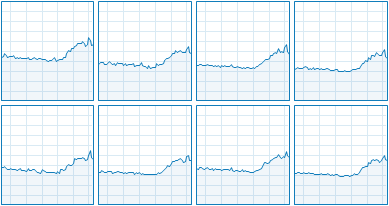
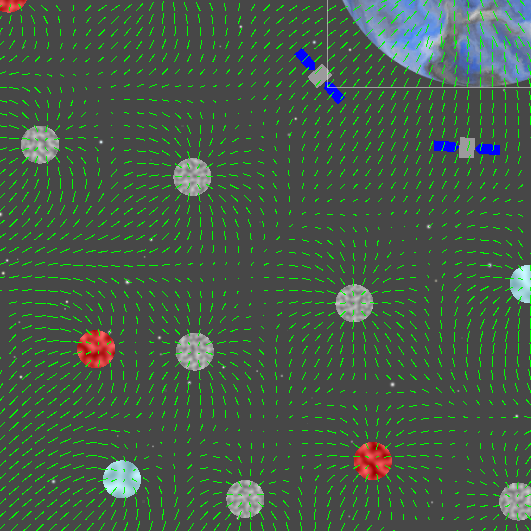

# My DOTS Experience

Here are my thoughts on the new Unity Data Oriented Tech Stack after
using it to create a game in 48 hours (for Ludum Dare). If you are
not interested in DOTS then I would recommend skipping to the last
section were I describe an interesting technique for handling gravity
and navigation.

## The Positive

The most impressive part of DOTS is the job system and the Burst compiler.
They enables easy and efficient multithreading that actually seems to balance
well over all processor cores. The syntax for creating jobs is quite verbose
and boilerplate:y but (instead structs instead of delegates), but it provides some
guarantees that avoids some problems, and can lead to optimisations. The upside
is that these technologies can be used without the rest of the DOTS.

## The Negative

The two other parts of DOTS that I used was the ECS (Entity-Component-System) and
the new physics system. These are lot less mature, which means the documentation is
lacking, especially for the physics. This caused a lot of lost time during Ludum Dare
and makes it obvious why Unity uses the "Experimental" tag.

The ECS API is also quite verbose and boilerplate:y, and there are multiple ways of
doing the same thing, some of which are already deprecated. However the most glaring issue
is the lack of tooling. The entity debugger helps, but it is not as fluid as normal gameobjects
in the hierarchy. Especially for creating prefabs you have to first create a gameobject and then
when playing convert it to a entity. Furthermore I resorted to creating Monobehaviours (e.g. "EnemySettings")
that the corresponding System (e.g. "EnemySystem") could reference to be able to assign values in
the Unity Editor. The last issue was that ECS doesn't respect normal Unity scenes, so when restarting
I had to manually delete all entities (and make sure the systems can handle the disappearing of referenced
gameobjects).

The physics system is a lot more fresh so I won't critique it too much. The biggest issue is really
the lack of documentation. I will however note that I was able to spawn thousands of rigidbodies
(cylinder shaped) while still having playable framerates (not sure what the Physics2D system would handle).

The job system is not without any criticism, and this is currently a major issue for game jams.
As of spring 2019 the standard for multithreaded web assembly is not finalised. This means any attempt
at using jobs or DOTS will not work in a WebGL build.

## Conclusion

I would not recommend using DOTS for game jams at the moment for two resons:

 - You don't want to spend time figuring out issues due to poor 
    documentation if you have a thight time limit.
 - Not being able to do a WebGL build (spring 2019) is a big issue
    for me personally, since I prefer not to download unkown executables
    from the internet when reviewing other peoples games.

For other types of games I would recommend looking into the job system and Burst compiler.

## Gravity and Navigation with a Vector Field

Lastly I want to mention a cool technique I used for efficiently managing
the gravity from the planet and all asteroids. Before spawning any rigidbodies
a high-resolution map of accelerations due to gravity is calculated. This allows
all gravity to be handled by a simple lookup in the vector field rather than
recalculated for each rigidbody. This approach is also used for the gravity wells
(mothership and mouse) by temporarily adjusting the vector field.

A bonus feature is that the vector field also helped me avoid implementing a navigation
algorithm. The transport ships are steered by simply selecting the direction to move based
on a minimisation of the euclidean distance and the magnitude of the vector field
(i.e. avoiding regions with high gravity).
