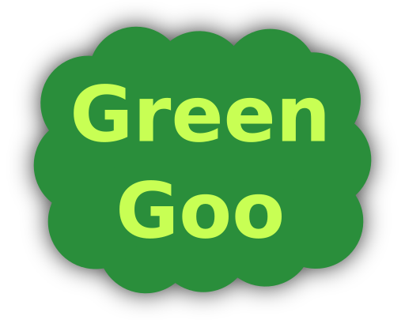
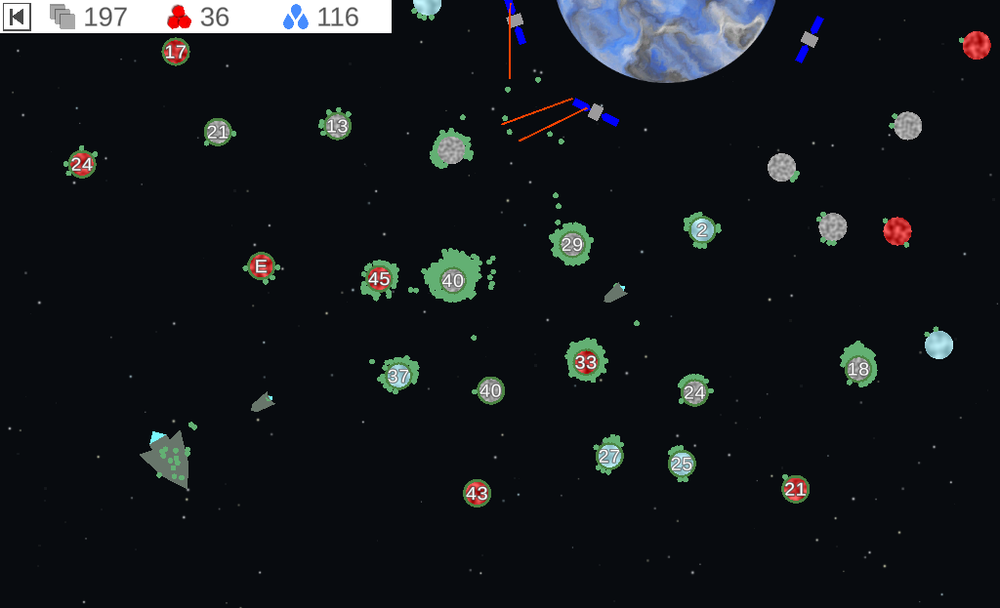

# Green Goo - Ludum Dare 44
  
Manipulate gravity to coordinate swarms of nano-robots in order to “greenify” a planet.  
  
My entry to the 44:th Ludum Dare game jam (compo rules).  

## Links

- [Download Game Here (Windows, Mac, Linux)](https://github.com/Aggrathon/LudumDare44/releases)
- [Ludum Dare Game Entry](https://ldjam.com/events/ludum-dare/44/green-goo)

## Development

This Ludum Dare I wanted to try using Unitys upcoming “Data Oriented Tech Stack”. This means the game can easily handle thousands of physics objects. The drawbacks are that the scope is more limited than originally envisioned *and* that I’m unable to do a WebGL build (multithreading not yet supported by WebAssembly).

### Tools Used

- Unity
- Visual Studio Code
- Blender
- Inkscape
- Abundant Music
- Audacity
